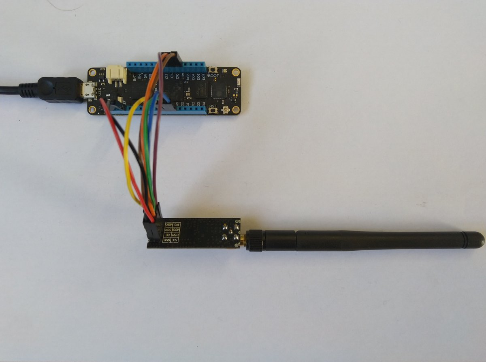

# nRF24L01WildernessLabsMeadow
C# Nordic Semiconductor [nRF24L01](https://www.nordicsemi.com/Products/Low-power-short-range-wireless/nRF24-series) library for
[Wilderness Labs](https://www.wildernesslabs.co) [Meadow](https://www.wildernesslabs.co/meadow) devices.

The repo has the source code for the series of blog posts written as I ported [techfooninja/Radios.RF24](https://github.com/techfooninja/Radios.RF24) to Wilderness Labs Meadow

01. DeviceSPI (https://blog.devmobile.co.nz/2020/02/29/net-meadow-nrf24l01-library-part1/)
02. Porting (https://blog.devmobile.co.nz/2020/03/04/net-meadow-nrf24l01-library-part2/)
03. Power level (https://blog.devmobile.co.nz/2020/03/08/net-meadow-nrf24l01-library-part3/)

[Sample client](https://blog.devmobile.co.nz/2020/03/06/wilderness-labs-nrf24l01-wireless-field-gateway-meadow-client/) for my WIndows 10 IoT Core Field Gateways.
